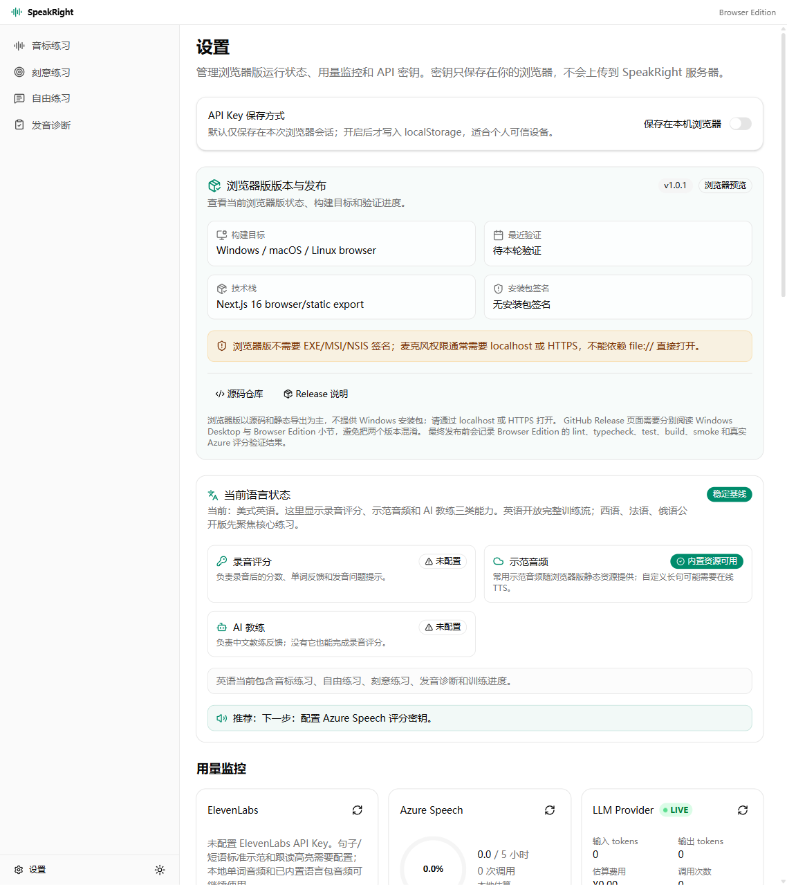
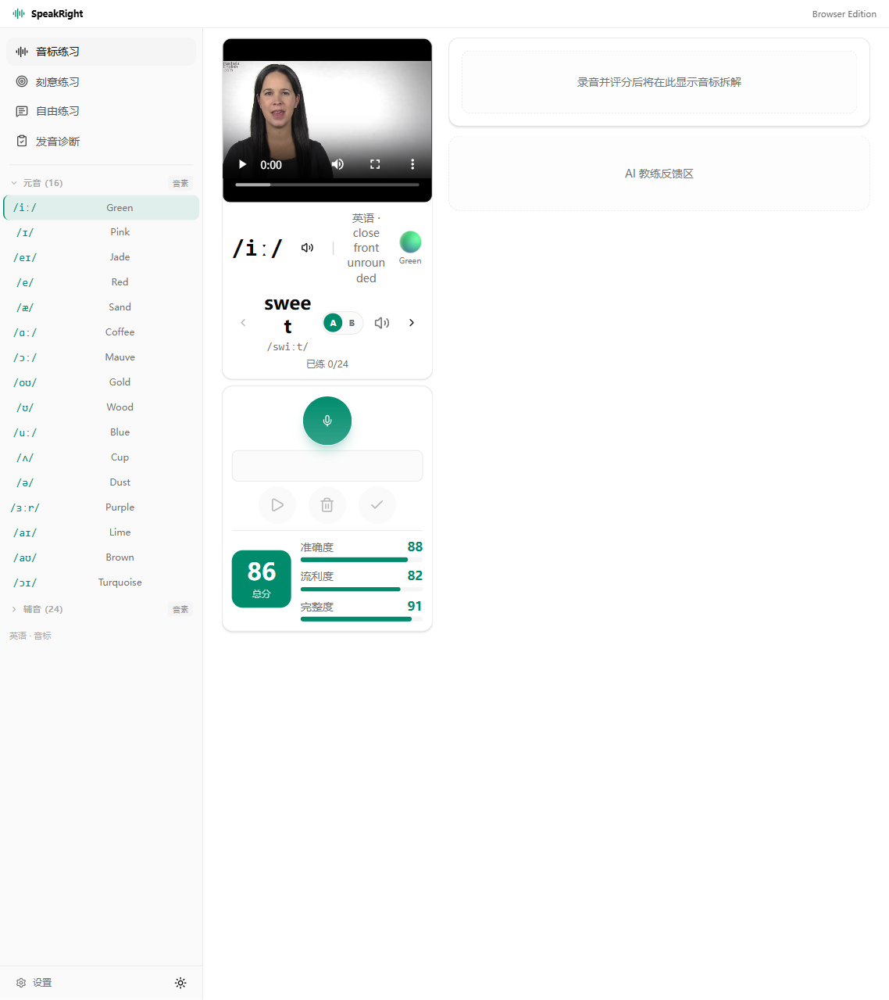
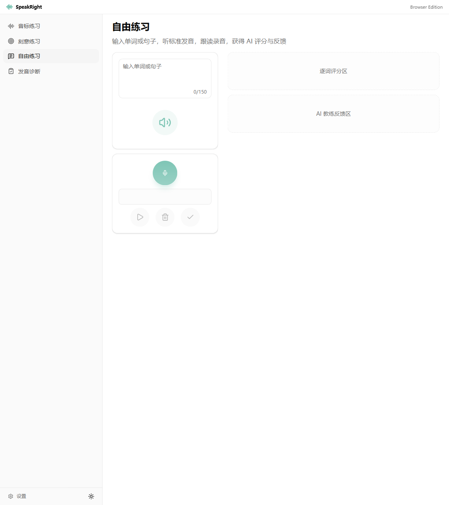
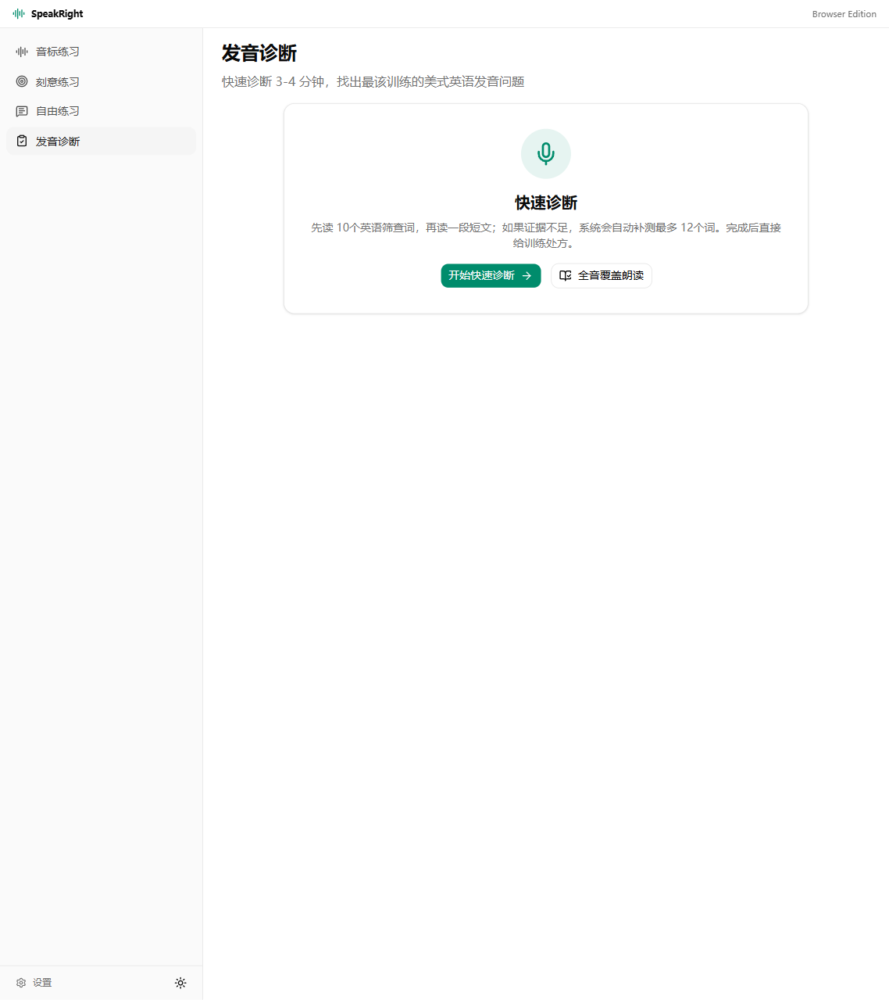
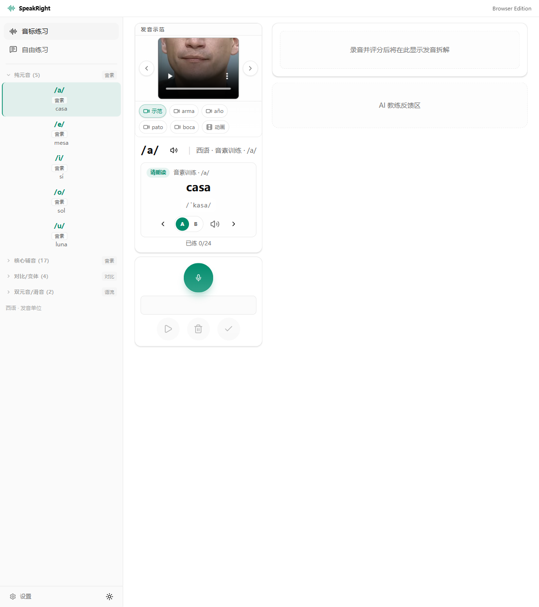
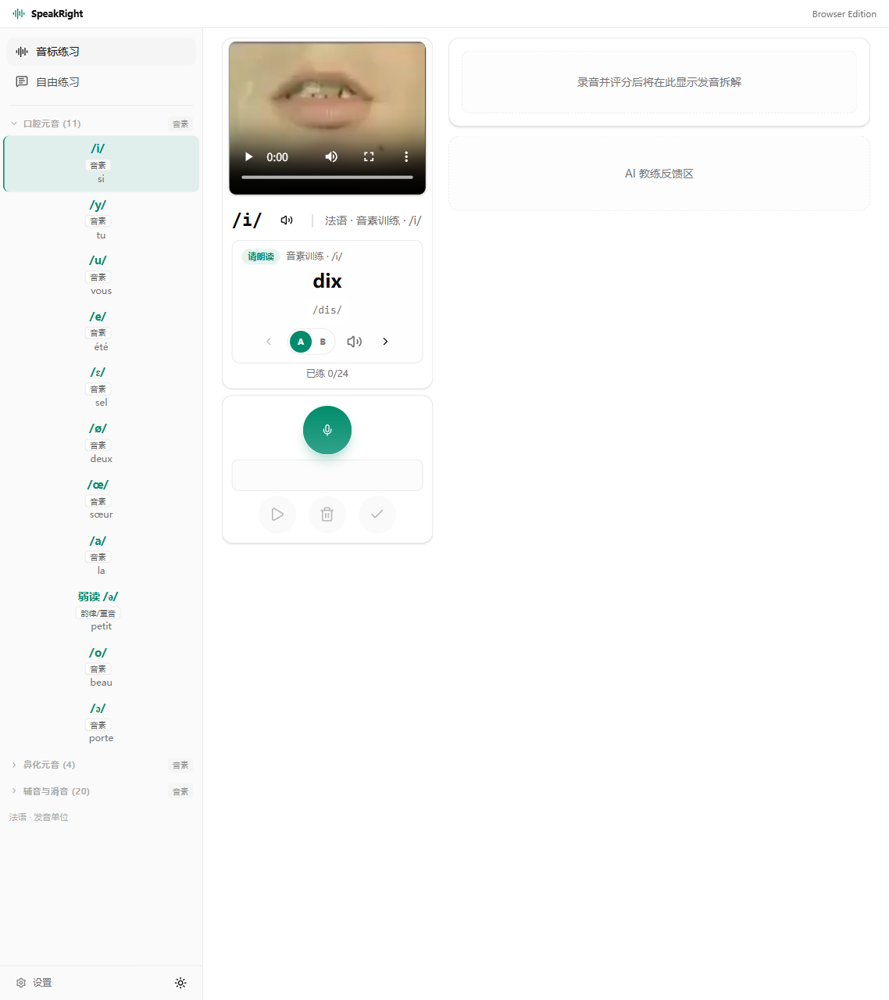
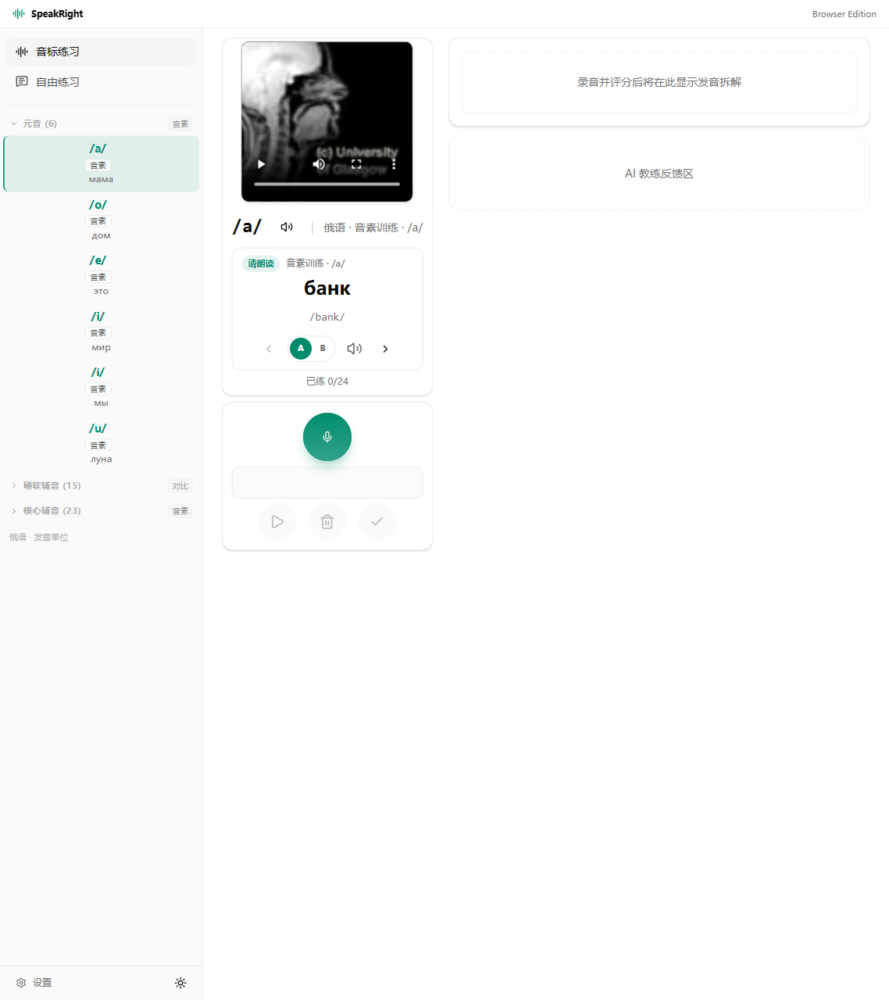

# SpeakRight

SpeakRight is an open-source pronunciation practice project for Chinese-speaking learners. It now has two deliberately separated editions so users can choose the right runtime without guessing which folder matters.

| Edition | Folder | Best for | Status |
| --- | --- | --- | --- |
| Windows Desktop | repository root | Windows users who want the installed Tauri app and Release EXE workflow. | Controlled test, unsigned artifacts. |
| Browser Edition | `apps/browser` | Windows, macOS, and Linux users who want to run SpeakRight in Chrome/Edge from a local server or static export. | Browser preview, BYOK, no hosted SaaS account. |

The Browser Edition is not a SaaS product. Users run it locally from source or a static export, then configure their own provider keys in the app. The Windows Desktop edition remains the packaged Tauri release track.

## Quick Start

Browser Edition development:

```bat
cd /d E:\SpeakRight
npm --prefix apps/browser install
npm run dev:browser
```

Open:

```text
http://localhost:3000
```

Static Browser Edition:

```bat
cd /d E:\SpeakRight
npm run build:browser
npm run serve:browser
```

Windows Desktop development:

```bat
cd /d E:\SpeakRight
npm run desktop:dev
```

The public Windows installer/Release EXE route is documented separately in the desktop docs. Current Windows artifacts are unsigned and should be treated as controlled-test builds until code signing is complete.

## Repository Map

| Path | Purpose |
| --- | --- |
| `apps/browser` | Cross-platform Browser Edition. No Tauri imports, no Windows installer scripts, no desktop runtime dependency. |
| repository root / `src` / `src-tauri` | Windows Desktop app. Tauri, Rust commands, Windows packaging, and desktop release gates belong here. |
| `docs/browser-edition` | Browser architecture, implementation plan, validation checklist, release notes, and third-party notices. |
| `docs/assets/screenshots/browser` | Browser Edition screenshots. |
| `docs/assets/screenshots` | Desktop screenshots and shared documentation images. |

## Browser Edition Features

- Sound-unit practice for English, Spanish, French, and Russian.
- Recording, waveform playback, Azure pronunciation score cards, and detailed word/phoneme breakdowns.
- Chinese AI coach feedback based on Azure evidence.
- Free-practice text input with recording and scoring.
- English assessment and advanced drill routes ported from the latest desktop app where browser constraints allow.
- Browser-local progress, score history, and settings.
- BYOK provider setup with session-first API key storage. Keys are persisted to `localStorage` only when the user explicitly enables local persistence.
- Microphone device selection for Chrome systems with multiple input devices.

Browser docs start at [`docs/browser-edition/README.md`](docs/browser-edition/README.md). The cross-platform user entry is [`docs/WEB.md`](docs/WEB.md).

## Browser Screenshots

| Settings and BYOK storage | English sound practice |
| --- | --- |
|  |  |

| Free practice | English assessment |
| --- | --- |
|  |  |

| Spanish | French | Russian |
| --- | --- | --- |
|  |  |  |

## Browser Validation

```bat
cd /d E:\SpeakRight
npm run lint:browser
npm run typecheck:browser
npm run test:browser
npm run build:browser
npm run browser:smoke:static
```

Route-level smoke against an already running server is also available:

```bat
cd /d E:\SpeakRight
npm run browser:smoke
```

## Windows Desktop

SpeakRight Desktop is a Tauri + Next.js pronunciation-training app for Chinese learners. It combines local teaching media, microphone recording, real Azure Speech pronunciation assessment, and Chinese AI coaching feedback in one desktop workflow.

American English (`en-US`) is the stable baseline. Spanish (`es-ES`), French (`fr-FR`), and Russian (`ru-RU`) are experimental modules: they expose sound-unit practice and free practice, while formal diagnosis, advanced drills, progress archives, and mastery/evidence views remain English-only until each language has its own release evidence gates.

### Desktop Screenshots

Screenshots below are captured from the packaged Release EXE, not a browser localhost session. The English score screenshot uses an explicit smoke-only demo state to show the post-recording layout; real user scores come from Azure Speech Pronunciation Assessment.

| Settings | English sound practice |
| --- | --- |
|  |  |

| Free practice | English diagnosis |
| --- | --- |
|  |  |

| Spanish | French | Russian |
| --- | --- | --- |
|  |  |  |

### Desktop Product Boundary

- Desktop release track. The installed app loads the static Tauri bundle, not a localhost dev server.
- Public review, source builds, and controlled Release EXE trials are supported. A signed public Windows release is not complete yet; unsigned EXE/MSI/NSIS artifacts must remain labeled as internal-test or controlled-test builds.
- The app defaults to a `1280 x 920` launch window with `800px` minimum height.
- API keys are configured locally in Settings and must never be committed.
- Spanish, French, and Russian word/phrase audio is bundled under `public/audio/language-packs/` with two local voice variants per item.
- Local articulation media lives under `public/videos/language-assets/`.
- Bundled media is not automatically relicensed by MIT. See `THIRD_PARTY_NOTICES.md` before redistributing packaged builds.

### Public Download Status

There is not yet a signed public Windows download. GitHub Release assets, workflow-dispatch artifacts, EXE/MSI/NSIS files, and local Release EXE builds are controlled-test artifacts unless a release note explicitly says the artifact is signed and public.

New users who are not part of a controlled-test pass should build from source or wait for a signed Windows release. Do not bypass SmartScreen, antivirus, or enterprise policy on a managed device only to try an unsigned artifact; report the blocker through the installation/startup issue template instead.

Maintainers should keep Release EXE validation as the acceptance path, but they must not describe an unsigned artifact as a stable public download.

## Language Support

| Language | Status | What is open now |
| --- | --- | --- |
| American English `en-US` | Stable baseline | Full phoneme practice, local word demos, free practice, word/sentence/contrast/prosody drills, diagnosis, progress evidence, replay/archive workflows, and AI coach feedback. |
| Spanish `es-ES` | Experimental | Sound-unit practice, local A/B word and phrase demos, Sounds of Speech articulation media where bundled, free practice, and Azure-scored recordings using `es-ES`. Stress/rhythm and other rule units remain teaching/practice guidance rather than formal mastery. |
| French `fr-FR` | Experimental | Sound-unit practice, local A/B demos, connected-speech teaching for liaison, enchainement, elision, schwa, final consonant silence, free practice, and Azure-scored recordings using `fr-FR`. Rule units do not masquerade as single-phoneme audio. |
| Russian `ru-RU` | Experimental | Sound-unit practice, local A/B demos, hard/soft consonant and stress/reduction practice material, free practice, and Azure-scored recordings using `ru-RU`. Stress, reduction, devoicing, assimilation, and cluster rules remain experimental evidence. |

## What The App Does

- Shows a language-specific sound-unit list with local teaching video or a source-backed fallback panel.
- Plays verified short target clips only when a real local target-sound asset exists.
- Provides A/B local example audio for practice words, phrases, and sentences.
- Records learner audio and sends it to Azure Speech Pronunciation Assessment with the selected language locale.
- Displays Azure-derived score summaries: total score, accuracy, fluency, completeness, and prosody when Azure provides it.
- Shows word, phoneme, syllable, stress, rhythm, and prosody analysis where the provider evidence is available.
- Generates Chinese AI coaching feedback from the Azure result, target text, language rules, and source-alignment constraints.
- Keeps English advanced drills, diagnosis, and progress evidence separate from experimental non-English modules.
- Handles missing keys, network failures, microphone failures, storage failures, and missing local assets with Chinese inline messages instead of silent no-ops.

## Real Scoring Boundary

SpeakRight does not ask an LLM to invent pronunciation scores. Numeric scores in user-facing practice flows come from Azure Speech Pronunciation Assessment, or from explicit test/smoke fixtures guarded by query parameters during automated smoke.

The selected language profile maps directly to Azure locales:

- `en-US` -> `en-US`
- `es-ES` -> `es-ES`
- `fr-FR` -> `fr-FR`
- `ru-RU` -> `ru-RU`

The LLM layer is downstream only. LLM providers only generate coaching explanations from Azure evidence; they can explain the Azure result in Chinese, suggest practice, and apply language-specific feedback rules, but they must not overwrite or fabricate the score numbers. The current release-hardening proof matrix and latest scoring-boundary tests live in `docs/operations/RC_EVIDENCE_AUDIT.md`, which is the source of truth for command results and Release EXE smoke/launch outcome. Do not treat an older commit SHA, download timestamp, or copied summary as the latest validated RC state without checking that audit.

## APIs And Providers

- **Azure Speech**: real pronunciation scoring and speech analysis. The app sends the active language locale to Azure for assessment.
- **ElevenLabs**: optional standard-demo TTS and previously approved bundled local language-pack audio. Routine validation queries usage only and does not generate new audio. Do not generate ElevenLabs audio without explicit maintainer approval.
- **LLM providers**: OpenAI-compatible providers can be configured for Chinese coaching feedback. They are not the scoring authority.
- **Youdao pronunciation**: English online dictionary fallback for word pronunciation when local English word audio is unavailable.

## Install And Run

For Windows installer use, source builds, and first-launch expectations, see `docs/INSTALLATION.md`.

Source build:

```bat
cd /d E:\SpeakRight
npm ci
npm run desktop:build
npm run desktop:preflight
npm run desktop:launch-release
```

Manual QA should start from the Release EXE:

```bat
cd /d E:\SpeakRight
npm run desktop:preflight
npm run desktop:launch-release
```

Developer mode is for debugging only:

```bat
cd /d E:\SpeakRight
npm run desktop:dev
```

For the daily desktop startup checklist, see `docs/operations/DESKTOP_STARTUP_RUNBOOK.md`. For the current Release Candidate evidence matrix, see `docs/operations/RC_EVIDENCE_AUDIT.md`.

## Desktop Validation

Run from `E:\SpeakRight`:

```bat
npm run test
npm run typecheck
npm run lint
npm run build:desktop-frontend
npm run desktop:build
npm run desktop:preflight
npm run desktop:ui-smoke
npm run desktop:launch-release
```

Supporting zero-generation audits:

```bat
npm run audio:parity:dry-run
npm run phonology:audio-policy:check
```

`desktop:ui-smoke` launches the Release EXE, checks Settings, English full-flow routes, Spanish/French/Russian core routes, non-English boundary routes, left-column phoneme scoring layout, and confirms the runtime is not served from `localhost`.

`audio:parity:dry-run` checks Spanish, French, and Russian local language-pack coverage and makes zero ElevenLabs calls. Keep exact counts centralized in `docs/operations/RC_EVIDENCE_AUDIT.md` instead of copying them into public overview text.

## Repository And Privacy

- Source code and source documentation are MIT licensed. See `LICENSE`.
- `package.json` remains `private: true` to prevent accidental npm publication; releases are desktop/browser artifacts, not an npm package.
- `.env.example` is documentation only. Do not commit real API keys, recordings, learning-data exports, tokens, or private user data.
- Browser Edition API keys and practice data stay in the user's browser storage unless the user exports them manually.
- Do not upload private recordings, full diagnostics bundles, API keys, bearer tokens, or local paths containing user names to public issues.
- Security reporting and secret-handling guidance are in `SECURITY.md`.
- Contribution rules are in `CONTRIBUTING.md`; community behavior expectations are in `CODE_OF_CONDUCT.md`; support routing is in `SUPPORT.md`.

## Current Limitations

- Windows artifacts are unsigned; public release still requires code signing.
- Browser Edition microphone access should be tested from localhost or HTTPS; direct `file://` launch is not the supported path.
- Spanish, French, and Russian remain experimental and must not be described as formal mastery or `evidenceMastery`.
- Some rule, prosody, or composite sound units intentionally do not show speaker buttons until exact local short audio exists.
- Release validation does not record live learner audio, call Azure live scoring, or generate ElevenLabs TTS in routine smoke.
- Provider availability, Azure locale behavior, browser media-device behavior, and WebView2 behavior can vary by machine, network, and account quota.

## Credits And Source Notes

SpeakRight depends on careful third-party educational and provider ecosystems:

- Rachel's English materials inform the English teaching-video experience where local English clips are bundled.
- American IPA Chart / americanipachart.com provides the source family for the English IPA chart audio mirrored in the app.
- University of Iowa Sounds of Speech Spanish materials are used for bundled Spanish articulation references where exact local assets exist.
- Seeing Speech / University of Glasgow and related phonetics references inform selected source-ledger decisions and some local articulation media.
- EasyPronunciation and similar pronunciation resources are used as reference material or source-ledger context where noted; they are not automatically bundled or treated as a redistribution license.
- Microsoft Fluent Emoji-style IPA images are used for English phoneme cards.
- Azure Speech, ElevenLabs, Youdao or configured online dictionary sources, and user-configured LLM providers power optional online capabilities subject to their own terms.

See `THIRD_PARTY_NOTICES.md` and `docs/browser-edition/THIRD_PARTY_NOTICES.md` for the full media and provider boundary.

## License

MIT.
